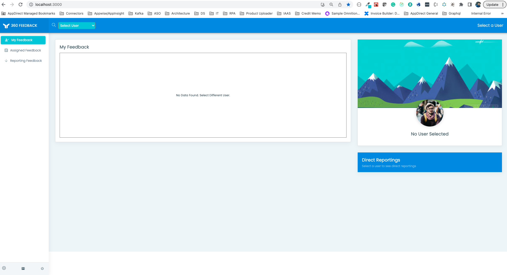
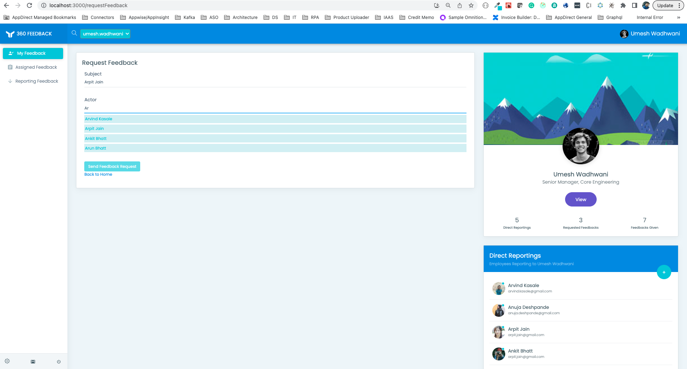
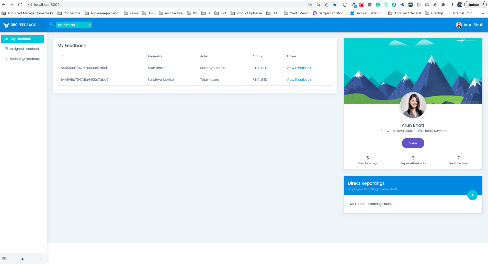
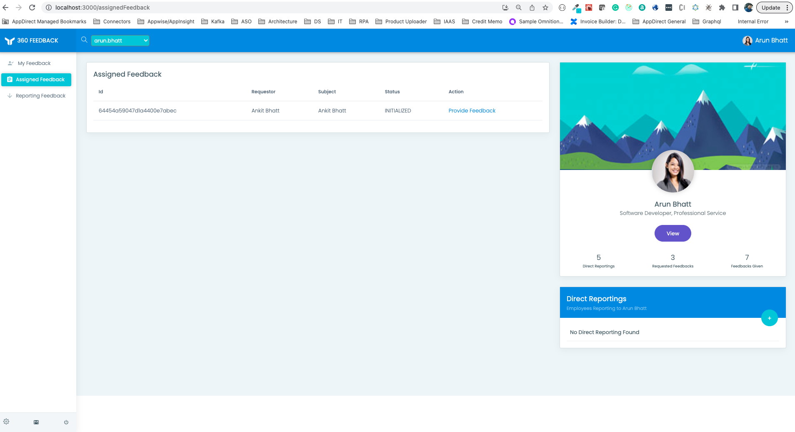
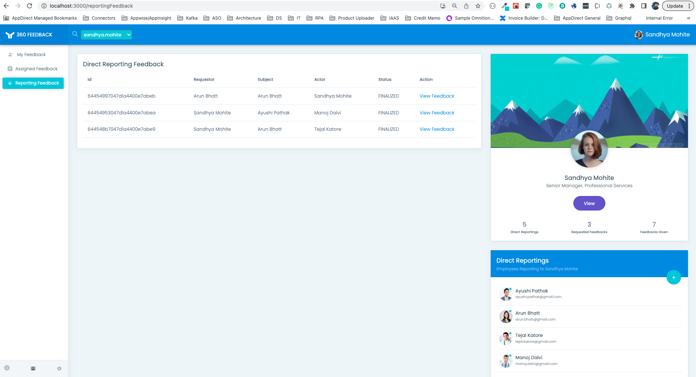
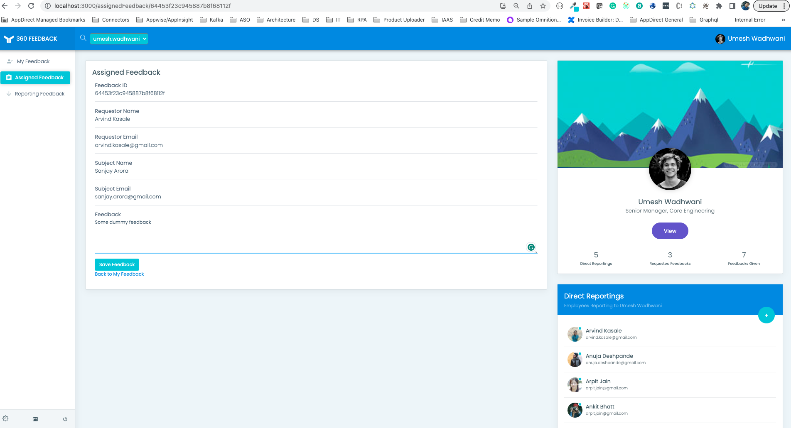
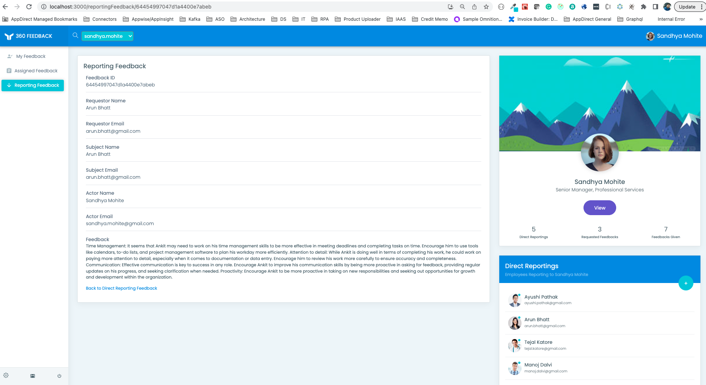

# 360 Degree Feedback UI

- UI Repository for the Intuit 360 Degree Feedback App
- Prerequisites
  - Needs a running instance of `User Management Service`
  - Needs a running instance of `Feedback Management Service`

## Problem Description
- You are building designing and building the 360-degree application shared with multiple
clients for collecting the feedback from peer, manager, business stakeholder. Feedback
can be visible to immediate manager.
- The 360-degree app has 3 actors:
1. Feedback Requester: Person looking for feedback
2. Manager: Can ask for feedback and review his direct employee feedback
3. Feedback Giver:- Someone who is giving the feedback on request

- System Targets
• There are 100K registered worker with almost 2K feedback request per day.
• 1k feedback are posted every day growing at a rate of 250 feedback per week.

- Technology
SpringBoot, REST/Graph QL, REACT or any other UI technology.

## UI Screenshots

### Anon User

### Request Feedback

### My Feedback

### Feedback Requested From Me

### Direct Reporting Feedback

### Submit Feedback

### View Feedback

## How to run locally

- Clone or Download the repository on local.
- Run `npm install` to install all dependencies.
- Download and run the prerequisite `Feedback Management Service` and `User Management Service`
- Run `npm start` to start the application on port `3000`
- Navigate in the browser to `http://localhost:3000` 